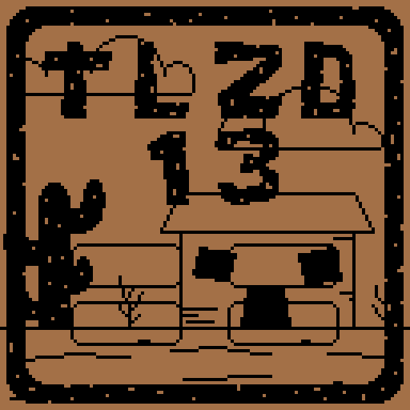
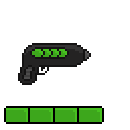

# Mandacaru

## Descrição
  
Mandacaru é um jogo *story-driven* de ação e plataforma 2D feito para computador, o qual está sendo desenvolvido por ***Lab Rats***, um dos grupos para o Projeto Integrado do terceiro ano de informática no CEFET-MG.

A *engine* usada para o desenvolvimento é Unity (atualmente Unity 2019.3.4f), com scripts na linguagem C#. Na implementação do projeto, pretende-se criar um sistema de persistência mantível e estável, aplicando *princípios S.O.L.I.D.* e fazendo análises precisas do domínio do problema e da solução do trabalho, de modo a satisfazer as disciplinas curriculares do curso.

## Visuais

A técnica de arte do jogo é *pixel art*, lembrando jogos retrô. Segue alguns *concept arts*

 

## Instalação

Para implantar o projeto em máquina local, é necessário abrir o projeto no [Unity](https://unity3d.com/pt/get-unity/download) (versão 2019.3.4f em diante).

## Organização

A convenção de nomes das branches para protótipos descartáveis é `proto/nome`, sendo que *nome* deve descrever o tipo de implementação do protótipo. Além dos protótipos, há a branch `master`, que contém as *releases* do projeto, a `develop`, que contém o estado atual do conjunto de ideias já prototipadas e aprovadas, e outras.

