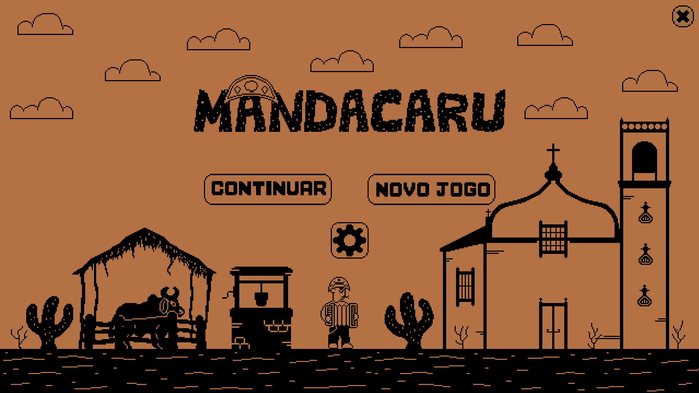

# Mandacaru

## Descrição

Mandacaru é um jogo *story-driven* de ação e plataforma 2D feito para computador, o qual está sendo desenvolvido por ***Lab Rats***, um dos grupos para o Projeto Integrado do terceiro ano de informática no CEFET-MG.

A *engine* usada para o desenvolvimento é [Unity](https://unity.com/) (atualmente Unity 2019.3.13f1), com scripts na linguagem C#. Na implementação do projeto, pretende-se criar um sistema de persistência mantível e estável, aplicando *princípios S.O.L.I.D.* e fazendo análises precisas do domínio do problema e da solução do trabalho, de modo a satisfazer as disciplinas curriculares do curso.

## Visuais

A técnica de arte do jogo é *pixel art*, lembrando jogos retrô. Segue alguns *concept arts*

 

## Dependências

- [Unity 2019.3.13f1](https://unity3d.com/get-unity/download/archive)
- TextMeshPro (Asset Store)
- Cinemachine (Asset Store)

## Build

Para implantar o projeto em máquina local, é necessário abrir o projeto no [Unity](https://unity3d.com/get-unity/download/archive) (versão 2019.3.13f1 em diante). Adicione a pasta raíz do repositório como um projeto Unity e, após abri-lo, abra o menu `file` > `build`. Selecione a plataforma e clique em build.